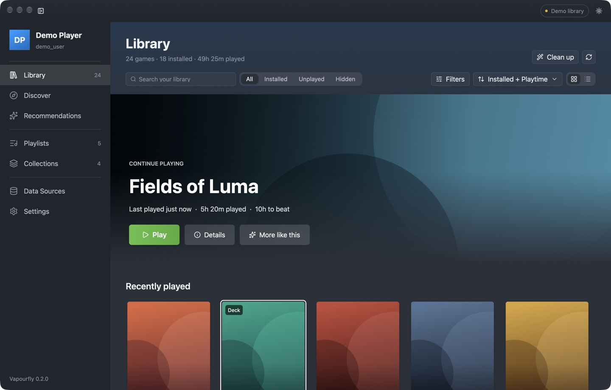

# Vapourfly

<p>
  <a href="https://github.com/thedavidweng/vapourfly/releases"></a>
  <a href="#homebrew-macos"></a>
  <a href="LICENSE"></a>
</p>

Manage your Steam library like Spotify playlists. Vapourfly is a local-first
CLI and desktop GUI for organizing, filtering, and cleaning up a Steam library
without going through Steam's own UI.

- **Playlists**: manual or rule-based (installed, genre, HLTB length, ProtonDB
  tier, rating, and more), shareable as compact `VF1:` codes, and syncable to
  Steam collections.
- **Discover, Recommendations, and Moods**: similar-game picks, session-length
  recommendations, and curated playlists generated from your own library.
- **Junk cleanup**: explainable detection of games you are unlikely to play,
  with one-step move to a collection or Steam's hidden list.
- **Safe writes**: every change to Steam files needs a dry run or explicit
  confirmation, and a backup is taken first.

Website: <https://thedavidweng.github.io/vapourfly/>



Vapourfly is pre-1.0. Expect breaking changes between minor versions.

## Platforms

- macOS (Apple Silicon builds; Intel from source)
- Linux x86_64, including SteamOS and the Steam Deck in Desktop Mode and Game
  Mode ([Steam Deck guide](docs/how-to/use-on-steam-deck.md))
- Windows x86_64

## Install

### Homebrew (macOS)

```bash
brew install --cask thedavidweng/tap/vapourfly
```

Upgrade:

```bash
brew upgrade --cask vapourfly
```

The Homebrew cask removes the quarantine flag automatically, so Gatekeeper
does not block the first launch, and links both `vapourfly` (CLI) and
`vapourfly-gui` (desktop app) onto your `PATH`.

### Pre-built binaries

Download the archive for your platform from
[GitHub Releases](https://github.com/thedavidweng/vapourfly/releases). Each
archive contains `vapourfly` (CLI) and `vapourfly-gui` (desktop app). Put the
CLI on your `PATH`.

macOS builds are not notarized, so Gatekeeper may require **Right-click →
Open** on first launch (if installing manually without Homebrew).

On Linux, install the runtime libraries (SteamOS already has them):

```bash
sudo apt install libxkbcommon0 libxkbcommon-x11-0 libxcb1 libwayland-client0 \
  libx11-6 libfontconfig1 libudev1 libasound2t64
# On older Debian/Ubuntu releases, use libasound2 instead of libasound2t64.
```

On a Steam Deck, run `./install-steamos.sh` from the extracted Linux archive.
It installs Vapourfly under `~/.local` and adds it to Steam as a non-Steam game.

### From source

Requires Rust 1.99 or newer. On Linux, install the GUI build dependencies
first:

```bash
sudo apt install cmake clang g++ pkg-config \
  libxkbcommon-dev libxkbcommon-x11-dev libxcb1-dev libwayland-dev \
  libx11-dev libxrandr-dev libxi-dev libxcursor-dev libxinerama-dev \
  libgl1-mesa-dev libasound2-dev libssl-dev libfontconfig1-dev libudev-dev
```

```bash
git clone https://github.com/thedavidweng/vapourfly.git
cd vapourfly
cargo install --path crates/cli
cargo run -p vapourfly-gui --release
```

## Quick start

```bash
# Check the Steam install, accounts, cache, and API credentials
vapourfly doctor

# Scan the library
vapourfly scan --format table

# Find junk, then move it to a collection (preview first)
vapourfly junk preview
vapourfly junk apply --collection "junk" --dry-run
vapourfly junk apply --collection "junk" --confirm

# Recommend 5 games for a 2-hour session
vapourfly recommend --minutes 120 --count 5

# Import a playlist and sync it to a Steam collection
vapourfly playlist import my-playlist.json
vapourfly sync collection my-playlist-id --dry-run
```

If Steam is not detected automatically, pass `--steam-dir` or set
`VAPOURFLY_STEAM_DIR`. Add `--offline` to any command to block all network
access and use only cached data.

The full command list is in [COMMANDS.md](docs/reference/COMMANDS.md), and the
[getting started tutorial](docs/tutorials/getting-started.md) walks through a
first session.

## Desktop GUI

`vapourfly-gui` covers the same features as the CLI: Library, Discover,
Recommendations, Playlists, Collections, Data Sources, and Settings (including
backups). It shows your Steam artwork, follows the SteamOS look, and works with
a mouse, a keyboard, or a game controller. On a Steam Deck it also supports
Game Mode and Steam's on-screen keyboard.

Try it without touching your Steam files:

```bash
vapourfly-gui --ui-demo
```

## Safety

Vapourfly edits Steam's collection files, so writes are guarded:

- Every write needs `--dry-run` (show a diff) or `--confirm` (apply). Omitting
  both is an error. The GUI asks for confirmation and shows a preview.
- A timestamped, hash-checked backup is created next to the file before every
  write. List and restore backups with `vapourfly backup list` and
  `vapourfly backup restore <file> --confirm`.
- Writes are atomic, and are refused while Steam is running unless you pass
  `--allow-steam-running`.

Details: [Steam file safety](docs/reference/STEAM_FILE_SAFETY.md) and
[back up and restore](docs/how-to/back-up-and-restore.md).

## Data sources and credentials

Steam Store, ProtonDB, PCGamingWiki, and HowLongToBeat work without
credentials. Optional keys add more metadata:

| Setting | Get it from | Adds |
|---|---|---|
| `VAPOURFLY_IGDB_CLIENT_ID`, `VAPOURFLY_IGDB_CLIENT_SECRET` | [Twitch Developer Console](https://dev.twitch.tv/console) | Genres, ratings, time-to-beat, similar games |
| `VAPOURFLY_RAWG_KEY` | [RAWG API](https://rawg.io/apidocs) | Genres, tags, ratings |
| `VAPOURFLY_STEAM_API_KEY` or `vapourfly settings set steam_api_key <key>` | [Steam Web API key](https://steamcommunity.com/dev/apikey) | Names for all owned games in one request |

Use your own keys. None are bundled with the app. Check what is configured
with `vapourfly sources status`. See
[configure API credentials](docs/how-to/configure-api-credentials.md) and
[API sources](docs/reference/API_SOURCES.md).

All data stays on your machine. See [PRIVACY.md](docs/reference/PRIVACY.md).

## Documentation

The [documentation index](docs/README.md) lists everything. Highlights:

- [Purge junk from your library](docs/how-to/purge-junk.md)
- [Plan a Deck session](docs/how-to/plan-deck-session.md)
- [Share and sync playlists](docs/how-to/share-and-sync-playlists.md)
- [Work offline](docs/how-to/work-offline.md)
- [Feature matrix](docs/reference/FEATURES.md)
- [How junk classification works](docs/explanation/junk-classification.md)

## Contributing

See [CONTRIBUTING.md](CONTRIBUTING.md). Contributors sign the
[CLA](CLA.md) on their first pull request. Domain terms are defined in
[CONTEXT.md](CONTEXT.md), and design decisions are recorded in
[docs/adr/](docs/adr/). Report security issues as described in
[SECURITY.md](SECURITY.md).

## Acknowledgments

Vapourfly's design was informed by
[Depressurizer](https://github.com/rallion/depressurizer),
[Gameloop.Vdf](https://github.com/BeyondDimension/Gameloop.Vdf),
[SteamTools / BD.SteamClient](https://github.com/BeyondDimension/SteamClient),
and [TinyWiiBackupManager](https://github.com/mq1/TinyWiiBackupManager). No
code from these projects is included. See
[THIRD_PARTY_NOTICES.md](THIRD_PARTY_NOTICES.md).

## License

Vapourfly is licensed under the
[GNU Affero General Public License v3.0 only](LICENSE) (`AGPL-3.0-only`).

"Vapourfly" and its logo are covered by the [trademark policy](TRADEMARKS.md).
Forks are welcome but must use a different name.
